# Multi-Object Tracking (MOT)

## What is MOT?

Multi-object tracking (MOT) is the task of tracking multiple moving objects in a video sequence. We want to understand the following properties ***over time***[^fn1]:
  
- How many objects are there?
- Who are they?
- Where are they?
- How are they moving?

That is, we want to sequentially process noisy sensor measurements to extract the *number* of dynamic objects and *each dynamic object's state*.

### Single Object Tracking (SOT)

This is a signal filtering problem. We want to sequentially process noisy sensor measurements to extract the true signal (position, motion properties, anything else of interest).

- Observations are typically partially or indirectly observable, e.g. using a camera, we can only see the object's relative position to the camera, but not its absolute position or velocity

### More Classic MOT

#### Sensor Detections[^fn1]

Classic MOT follows this setup:

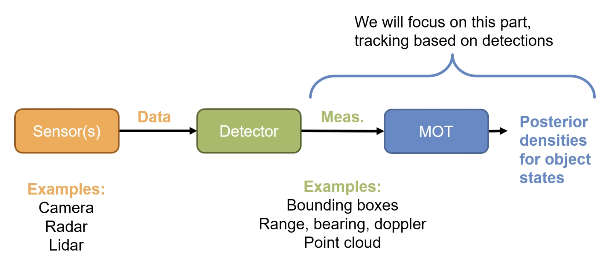

An example DL setup is shown below:

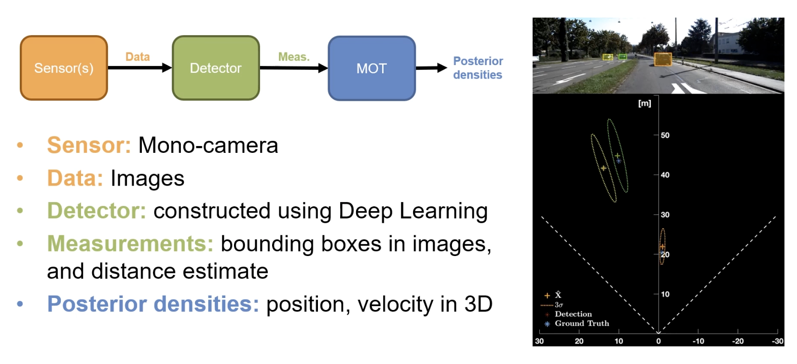

- Uncertainties are represented by the ellipses (defined by covariances)

#### Tracking

***Point Object Tracking*** states that we have at most one detection per object per frame (i.e. each car in an image is one object detection).

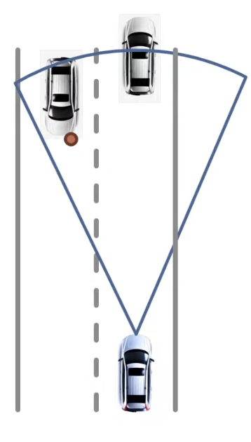

***Extended Object Tracking*** states that we have multiple detections per object per frame (i.e. each car in an image may have multiple object detections).

- This lets you use multiple detections to also estimate object extent (i.e. shape/size)

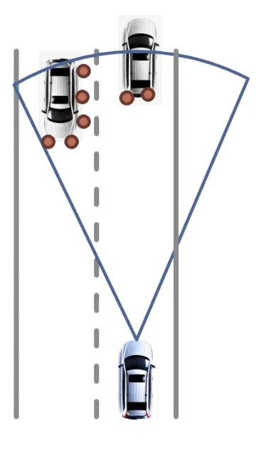

***Group Object Tracking*** states that multiple objects are treated as a single entity (*a group*). You can have more than one detection per group, per frame.

- Allows for a hierarchical understanding of the scene (e.g. group behvaiour analysis or when individuals are difficult to track)

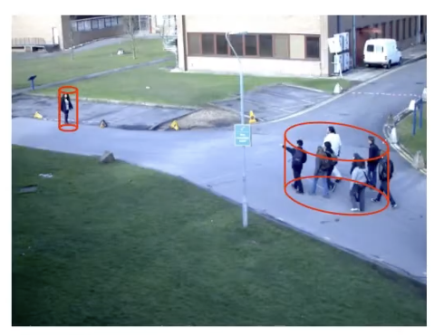

***Multipath Propogation Tracking*** states that you can have more than one detection per object per frame due to ***multipath phenomenon***.

- Radar reflects off objects in the environment, bouncing off multiple objects before reaching the sensor

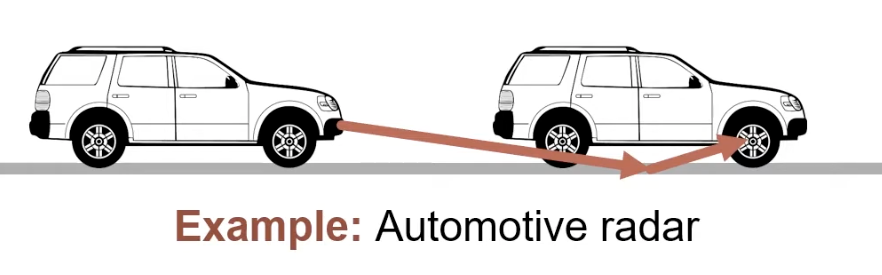

***Unresolved Target Tracking*** states that multiple objects may cause a single detection (due to merging of reflected signals).

- When objects are moving close to each other at similar speeds

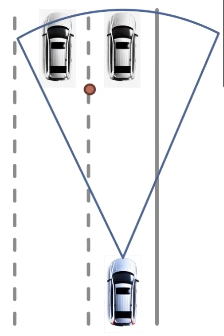

## Challenges in Classical MOT

There are many issues with classical MOT, including:

- Unknown object number in FOV
- Unknown object states (e.g. occlusion, partial occlusion, etc.)
- Objects moving around each other and occlusion
- Objects leaving or entering FOV (object death/birth)
- Detectors are susceptible to false positives (clutter/false alarms) and false negatives (missed detectionsz)

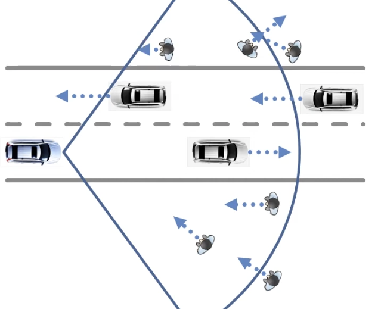

### FNs and FPs

***Missed detections*** (false negatives) are incredibly important to catch in MOT, especially in applications where these can lead to fatalities (e.g. autonomous driving missing a pedestrian).

- False positives (clutter/false alarms) are also important to catch, but are typically less critical than false negatives, although they can still lead to issues, such as a car driving off the road because of multiple false detections ahead

### Data Association

Also known as the ***correspondence problem***, this is the issue of understanding which detections correspond to objects or clutter.

- I.e. are objects detected in frame $t$ the same as objects detected in frame $t+1$?

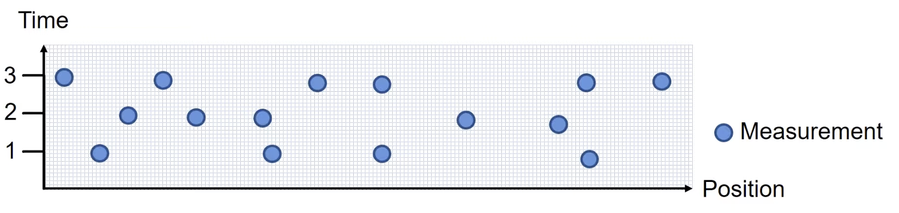

In the above example, without having data association for different objects and measurements, how can we track the same object across frames?

One potential solution is using data association methods like clustering of measurements to group measurements into objects over time.

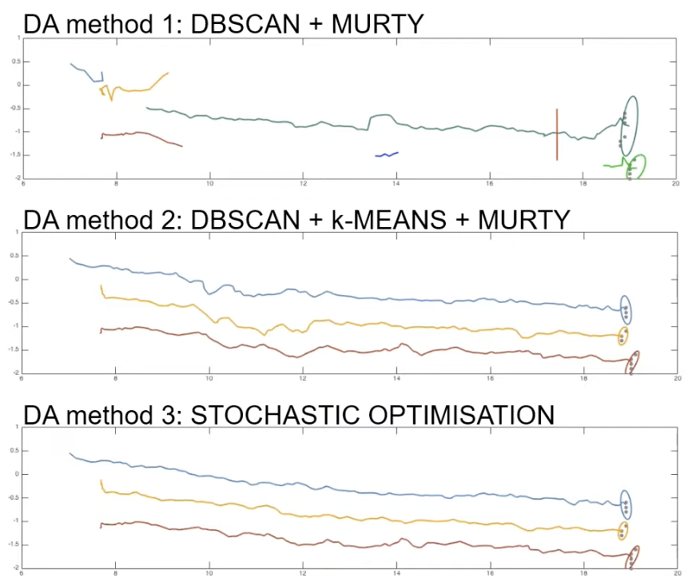

More modern methods like SORT use Kalman filters to predict tracklet locations in new frames and use IoU between predicted locations and detections to resolve data association issues[^fn2]. Instead of Kalman filters, deep learning can be used to learn more complex motion patterns. Appearance features can also be used to help re-identify occluded objects, for example, in DeepSORT.

- Matching between tracklets and detections is done using the Hungarian Algorithm or via some greedy assignment

#### Tracking by Detection

Tracking by detection is a paradigm in MOT, where powerful object detectors (e.g. CenterNet, YOLO, etc.) are utilized to obtain higher tracking performance[^fn2].

#### Detection by Tracking

This is the use of tracking to improve detection performance[^fn2]. This involes methods that perform motion prediction on tracklets to fuse predicted locations with detections or as downstream feature representations.

- Most methods MOT methods only keep detection boxes > $\text{IoU}=0.5$

## ByteTrack[^fn2]

ByteTrack associates *almost every* detection with a *tracklet*, utilizing similarities for low-score detections to resolve data association issues. Often, low-score detections are likly due to ***occlusion***, and are not false positives; removing them would lead to disjoined/fragmented trajectories.

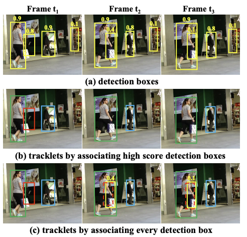

The above figure shows detections and associated trackets in 3 frames, $t_1, t_2, t_3$. The bounding boxes and confidence scores are shown in **(a)**. Notice, from frame $t_1$ to $t_2$ to $t_3$, the same object is detected in each frame, but the associated confidence score changes from 0.8 $\rightarrow$ 0.4 $\rightarrow$ 0.1 due to occlusion.

- In **(b)** and **(c)**, the same color represents the same tracklet/identifier
- Most MOT methods would remove the low-confidence detections (i.e. $t_2$ and $t_3$), shown by **(b)** (only keeping tracklets associated with high-confidence detections)
- By using predicted boxes of previous tracklets (via Kalman Filter) in dashed boxes, ByteTrack is able to correctly match the low-confidence bounding boxes in terms of IoU, shown by **(c)**

***BYTE*** (*tracking BY associaTing Every detection box*) is used to recover occluded objects:

1. High-confidence boxes are matched to tracklets via motion similarity (i.e. IoU) or appearance similarity (i.e. Re-ID)
2. Low-confidence boxes are matched to remaining tracklets, filtering out background noise (usually not matched to any tracklet)

- Low-confidence matching is done via IoU alone (not appearance similarity), as severe occlusion, motion blur, and other appearance features are not reliable

ByteTrack is a tracker that uses a detector (i.e. YOLOX in the paper) and a ***motion model*** (i.e. *Kalman Filter*) to predict tracklet locations in the next frame.

This method is simple and doesn't rely on complex approaches or attention mechanisms.

### Algorithm Pseudocode

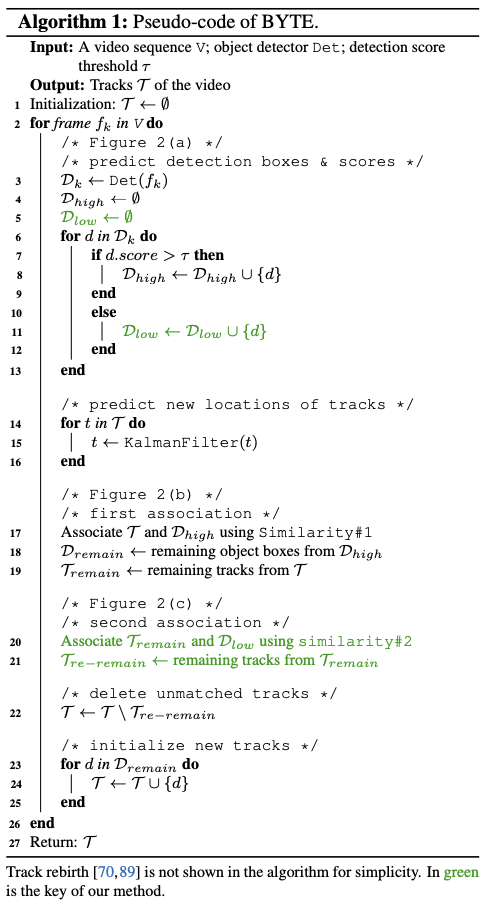

- Although track rebirth is not explicitly shown above, it is necessary for identity preservation
- $\mathcal{T}_{re-remain}$ is put into $\mathcal{T}_{lost}$ after the second association and kept for a number of frames (e.g. 30) before being deleted, otherwise we keep it in $\mathcal{T}$ for potential matching
- $\mathcal{T}_{lost}$ boxes and identities are not output
- The unmatched high-confidence detections become new tracks
- Default score threshold $\tau$ is 0.6 and only keep a match between detection box and tracklet box if IoU $> 0.2$ otherwise send to $\mathcal{T}_{lost}$

### Results

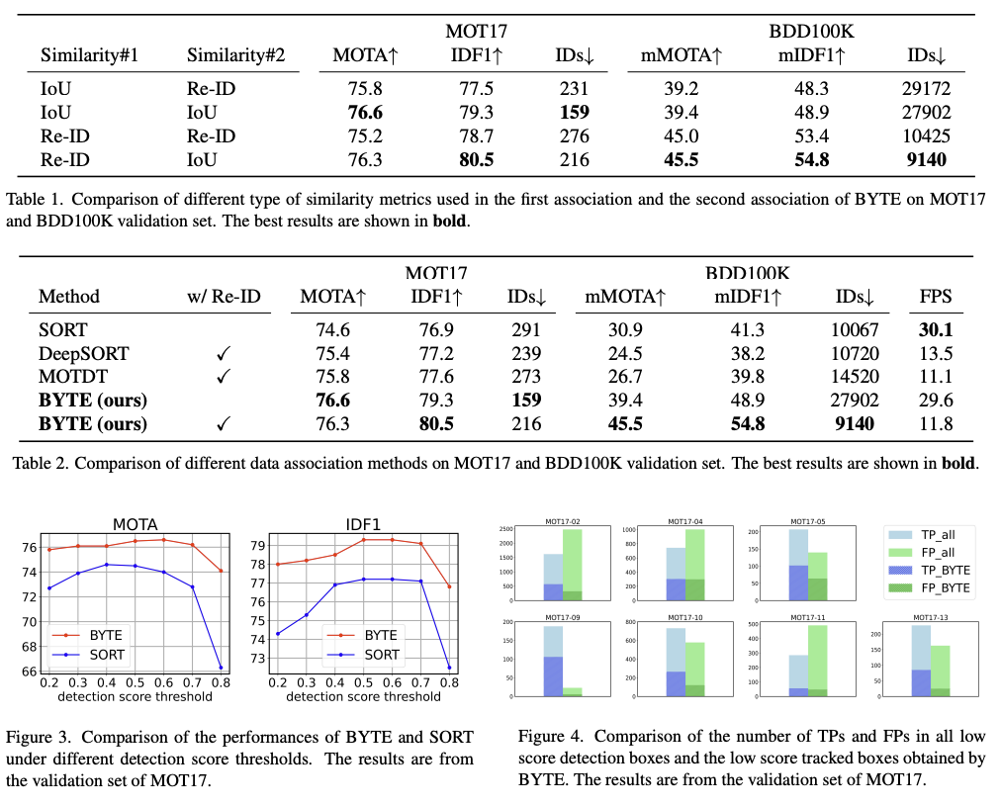

ByteTrack outperforms SORT (baseline), DeepSORT, and MOTDT on almost all metrics, except FPS.

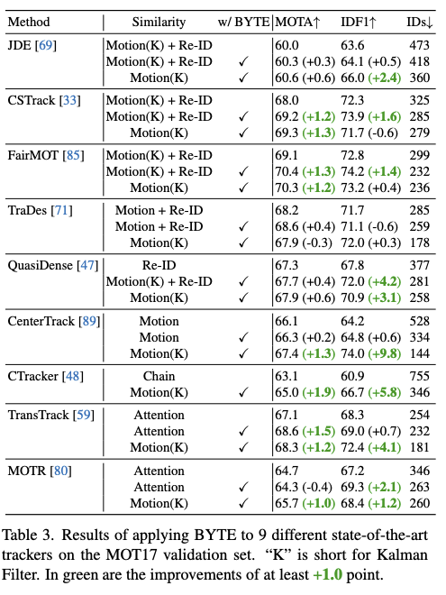

Combining ByteTrack with existing trackers can stabilize and improve their results!

## Sources

[^fn1]: [Introductory Playlist on MOT](https://www.youtube.com/watch?v=ay_QLAHcZLY&list=PLadnyz93xCLhSlm2tMYJSKaik39EZV_Uk)
[^fn2]: [ByteTrack: Multi-Object Tracking by Associating Every Detection Box](https://arxiv.org/pdf/2110.06864)