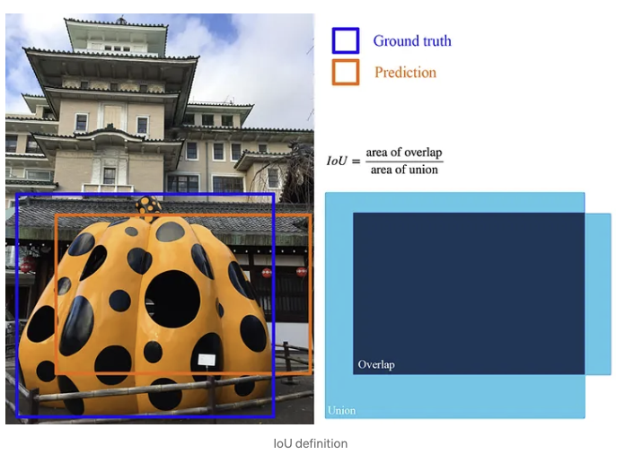
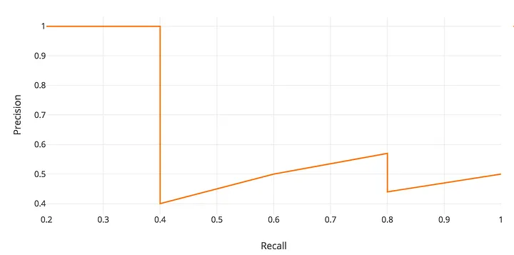
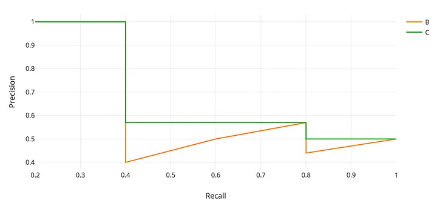

# Object Detection (OD)

## What is Object Detection?

***Object detection (OD)*** is a natural extension of ***image classification***, where instead of simply outputting an *object label* given an input image, we also output the *object location*. That is, we want to know, *What objects are where?*[^fn1]

OD serves as a core component of many computer vision tasks, including but not limited to *image segmentation*, *keypoint detection*, *visual question answering*, and *pose estimation*.

## OD Metrics

In practice, OD relies heavily on being both *accurate* in terms of object localization/classification, and *low latency*, as many practical applications require real-time processing. The following section will cover the metrics used to evaluate OD models[^fn2].

First, recall (haha) basic classification metrics:

***Precision*** is a measure of how accurate we are, i.e. out of all our positive predictions, how many are correct?
$$
\text{Precision} = \frac{TP}{TP + FP}
$$

***Recall*** is a measure of how complete we are, i.e. out of all the positive ground truths, how many did we end up detecting?
$$
\text{Recall} = \frac{TP}{TP + FN}
$$

***F1 Score*** is the harmonic mean of precision and recall, representing a balance between precision and recall.
$$
\text{F1 Score} = \frac{2 \times \text{Precision} \times \text{Recall}}{\text{Precision} + \text{Recall}}
$$

### Intersection over Union (IoU)

***IoU*** $\in [0, 1]$ is used to measure object localization accuracy between the predicted box and the ground truth, specifically the overlap. We typically use a threshold of 0.5, where IoU > 0.5 is considered a detection, otherwise it is considered missed.

$$
\text{IoU} = \frac{\text{Area of Intersection}}{\text{Area of Union}}
$$
$$
\text{Area of Union} = \text{Area of Prediction} \cup \text{Area of Ground Truth}
$$
$$
\text{Area of Intersection} = \text{Area of Prediction} \cap \text{Area of Ground Truth}
$$

### Mean Average Precision (mAP)

AP is defined as average detection precision under different recalls (i.e. IoU thresholds), evaluated per class. Typically, mAP is the average AP across all classes. ***The de facto standard is 0.5-IoU mAP.***[^fn1]

For a given class, suppose there are $C$ occurences in a dataset. We calculate AP as followed.

1. Rank predictions by their confidence score (i.e. output probability)
2. Determine if a prediction is 'correct' (i.e. our true positives) using IoU > threshold (e.g. 0.5)
3. For each ranked prediction $i$ from rank 1 to rank N,
   1. Calculate precision using the number of correct predictions so far (i.e. $\frac{TP_{\leq i}}{TP_{\leq i} + FP_{\leq i}}$). $TP_{\leq i}$ is the number of true positives so far, $FP_{\leq i}$ is the number of false positives so far, so $TP_{\leq i} + FP_{\leq i}$ is just the current rank $i$, since we are only ranking predictions for this class in the first place.
   2. Calculate recall using the number of correct predictions so far (i.e. $\frac{TP_{\leq i}}{TP_{\leq i} + FN_{\leq i}}$). Notice, $FN_{\leq i}$ is the number of missing class predictions so far, so $TP_{\leq i} + FN_{\leq i}$ is just the number of ground truth occurences so far.
4. Build a precision-recall curve by plotting these ordered precision and recall values.
5. Calculate AP by computing the area under the precision-recall curve. E.g. for the precision-recall curve shown below, AP is the area under the curve, where the curve is precision as a function of recall. Also notice that because $\text{Precision} \in [0, 1]$ and $\text{Recall} \in [0, 1]$, AP is also in $[0, 1]$.

- Which we smooth out (in green) for monotonicity (and for reducing variation due to small sample noise) and then use for AP calculation (i.e. $p_{\text{smooth}}(r) = \max_{r' \leq r} p(r')$)

$$
\text{AP} = \int_{0}^{1} \text{Precision}(r)  dr
$$

6. Calculate mAP by averaging APs across all classes.

### Estimating APs

We can generally estimate APs using sums
$$
\text{AP} \approx \sum_{i=1}^{N} p_{\text{smooth}}(r) \Delta r_i
$$
where $r_i$ is the recall at the $i$th ranked prediction, and $\Delta r_i$ is the change in recall that we define. For all the following we use $p_{\text{smooth}}(r)$.

#### Interpolated AP

In interpolated AP, we approximate AP by sampling $N$ points on the precision-recall curve and setting $\Delta r_i = \frac{1}{N}$.

#### AUC AP

In AUC AP, we sample $p_{\text{smooth}}(r)$ when it drops and directly compute AP as the sum of the rectangles segmented by each drop. Here, $N$ is the number of precision drops, and $\Delta r_i = r_{i+1} - r_i$ for $i \in [1, N]$.

#### COCO mAP

##### IoU Thresholds

COCO mAP is a series of APs evaluated at different IoU thresholds. (i.e. nothing differentiating mAP from AP in this case, COCO mAP *is* the AP)

- $\text{AP}^{\text{IoU} = 0.5}$ is what we have been discussing (i.e. thresholding correct predictions at IoU > 0.5)
- $\text{AP}^{\text{IoU} = 0.75}$ provides a stricter threshold

When reporting COCO mAP, the primary challenge metric used is
$$
\text{AP} = \text{AP}^{\text{IoU} = 0.5:0.05:0.95}
$$
This means, AP is averaged across IoU thresholds from 0.5 to 0.95 in increments of 0.05. This encourages more accurate object localization (i.e. higher IoUs).

##### Object Scale AP

COCO mAP is also evaluated at different object scales,

- $\text{AP}^{\text{small}} \implies \text{object area} < 32^2$
- $\text{AP}^{\text{medium}} \implies \text{object area} \in [32^2, 96^2)$
- $\text{AP}^{\text{large}} \implies \text{object area} \geq 96^2$

##### Average Recall

In addition to AP, COCO also has average recall reporting.

- $\text{AR}^{\text{max} = 1} \implies$ %AR given 1 detection per image
- $\text{AR}^{\text{max} = 10} \implies$ %AR given 10 detections per image
- $\text{AR}^{\text{max} = 100} \implies$ %AR given 100 detections per image

This is also calculated at different scales.

#### AP Redundancy

Many datasets report $\text{AP}$, but the way they calculate them are different. For accurate comparisons, you should use the same AP calculation method as the dataset.

## Early Approaches

### Traditional Detectors

While much of this project is focused on modern, deep learning-based OD models, it is worth touching upon some classic methods. These relied heavily on domain-specific feature engineering, as well as typical sliding window techniques.[^fn1]

- Sliding window over images and inspecting every window for features
- Development of augmentation-invariant feature transforms (e.g. scale-, resolution-, translation-, illumination-invariance)
- Ensembled feature extraction using mixtures

### Early Deep Learning Approaches

With the advent of CNNs ability to generate robust and high-level image representations, a new class of OD emerged, the *CNN-based two-stage detectors*.[^fn1] The 'two-stage' refers to

1. Region proposals using CNN features
2. Standard OD classification and Bounding Box Regression on **(1)**

Typically, this is a coarse-to-fine paradigmn, where coarse processing improves recall, and fine processing provides more granularity on top of the coarse results.

RCNN was the first to implement this, extracting region proposals, rescaling to fixed sizes, and extracting features using a CNN. Features are then input into classic OD classifiers and bounding box regressors. SVMs were used for classifying the regions and linear regression was used for bounding box prediction. These were limited by computation on overlapping region proposals.

Many following models build upon this framework, applying their own innovations

- Spatial Pyramid Pooling to handle variable image/region size without rescaling $\mapsto$ fixed-size representations (no need to compute features over multiple scales)
- Simultaneous detector + bounding box regression using a single CNN (Fast RCNN)
- CNN-based Region Proposal Network (RPN) to directly generate proposals (class prediction + bounding box prediction) + NMS to remove overlapping proposals $\mapsto$ FC layer for final classification + bounding box regression (Faster RCNN)
- Applying region proposals to not just the top CNN feature layer, but also lower layers (Feature Pyramid Network)

### Modern Deep Learning Approaches

Current methods are classified as *one-stage detectors*, providing an end-to-end solution to the object detection problem.[^fn1] These perform one-step inference, suitable for real-time applications, although less accurate on dense/small objects.

- YOLO used a single network for end-to-end fast inference
- SSD used multi-reference/resolution detection to improve small object detection
- RetinaNet introduced focal loss to put more emphasis on difficult training examples
- Instead of anchor boxes, CornerNet apply keypoint detection to decouple/re-group corners
- CenterNet follows keypoint paradigm + NMS using the center point of an object as reference
- DETR switches from CNN backbones to Transformer-based backbones, using attention alone to allow for a global receptive field

## Building Blocks of Object Detectors

### Multi-Scale Detection

- *(Feature pyramids + sliding windows).* glide a fixed size detection window over feature maps of different scales
- *(Detection + object proposals).* generate class-agnostic reference boxes (that likely contain objects) to reduce the search space (avoid exhaustive sliding window search)
- *(Deep regression + anchor-free detection).* More compute means we can directly predict bounding box coordinates using deep learning features
  - The keypoint paradigm is a group-based method that detects keypoints (corners, centers, or representative points) and then performs object-wise grouping
  - The group-free paradigm regards an objects as one/many points and uses those point attributes to predict the bounding box
- *(Multi-reference/-resolution detection).* This is the current SOTA method for multi-scale detection. Multi-reference detection defines a reference set (i.e. anchors - boxes and points), at each location in an image and predict a detection box based on these references. Multi-resolution detection uses multiple different layers of the network (i.e. different scales) to generate detections.

### Context Priming

### Sample Selection

### Loss Functions

### Non-Maximum Suppression

## YOLO

*You Only Look Once (YOLO)* is a real-time capable one-stage detector, i.e. it applies a single neural network to the full image. At a high level, YOLO-based models work by dividing the image into a grid of cells, and for each cell, they simultaneously predict the bounding box and class of the objects present. *Non-max suppression (NMS)* is then used as a post-processing step to remove overlapping bounding boxes.

## RF-DETR

Unlike YOLO, RF-DETR does not require NMS, and also uses relatively minimal data augmentations to achieve state-of-the-art performance.

## Sources

[^fn1]:[Object Detection in 20 Years: A Survey](https://arxiv.org/pdf/1905.05055)
[^fn2]:[mAP for Object Detection](https://jonathan-hui.medium.com/map-mean-average-precision-for-object-detection-45c121a31173)